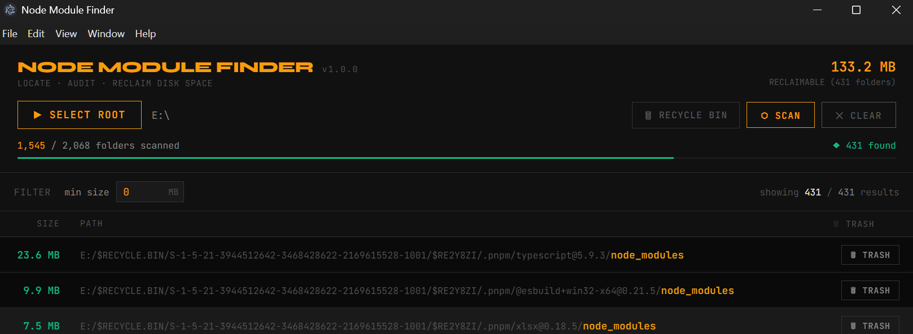

# Node Module Finder

A desktop application built with **Electron + React + Vite** to scan, audit, and reclaim disk space consumed by `node_modules` folders across your projects , space consumed by all the `node_modules` is displayed on the top right corner post scan and calculation .

## 

## Table of Contents

- [Features](#features)
- [UI Controls Reference](#ui-controls-reference)
- [Delete Modes Explained](#delete-modes-explained)
- [⚠️ Risks of File Deletion](#️-risks-of-file-deletion)
- [Getting Started](#getting-started)
- [Architecture](#architecture)

---

## Features

| Feature            | Description                                              |
| ------------------ | -------------------------------------------------------- |
| Folder Selection   | Native OS folder picker to choose a root directory       |
| Recursive Search   | Async non-blocking scan of all subfolders                |
| Size Calculation   | Each `node_modules` folder is measured (KB / MB / GB)    |
| Size Filter        | Filter results by minimum folder size                    |
| Progress Tracking  | Live counter showing folders scanned vs total            |
| Cancel Search      | Safely abort a scan mid-way                              |
| Recycle Bin Delete | Move `node_modules` to OS trash (recoverable)            |
| Permanent Delete   | Instantly destroy `node_modules` forever (unrecoverable) |

---

## UI Controls Reference

### Top Bar Controls

#### 1. SELECT ROOT — Folder Picker

```
┌─────────────────┐
│  ▶  SELECT ROOT │
└─────────────────┘
```

- Opens your operating system's native folder browser
- The chosen path becomes the root for the recursive scan
- Disabled while a scan is running

---

#### 2. DELETE MODE TOGGLE

The most important toggle in the app. Controls what happens when you click a delete button on any result.

**Mode A — Recycle Bin (default, safe)**

```
┌──────────────────────┐
│  🗑  RECYCLE BIN     │
└──────────────────────┘
  Grey border · default state
```

- Deleted folders are sent to your OS Recycle Bin / Trash
- Files **can be recovered** from your system trash
- Safe to use if you are unsure

---

**Mode B — Permanent Delete (no file recovery )**

```
┌──────────────────────────┐
│  ⚠  PERMANENT DELETE    │
└──────────────────────────┘
  Red glowing border · danger state
```

- Deleted folders are **instantly and permanently destroyed**
- Files **cannot be recovered** — no undo, no trash
- The status bar also shows `⚠ PERMANENT DELETE ACTIVE` while this mode is on
- Use only when you are 100% certain you want the space freed immediately

> Click the button again to toggle back to Recycle Bin mode at any time.

---

#### 3. SCAN Button

```
┌──────────┐
│ ⬡  SCAN  │
└──────────┘
  Amber border · starts search
```

- Begins recursive scan from the selected root folder
- Disabled until a root folder is selected
- Replaced by the CANCEL button once scan starts

---

#### 4. CANCEL Button

```
┌────────────┐
│ ■  CANCEL  │
└────────────┘
  Red border · stops search
```

- Safely aborts a running scan
- Uses a cancellation flag — current folder finishes, recursion stops
- Results collected so far remain visible

---

#### 5. CLEAR Button

```
┌───────────┐
│  ✕  CLEAR │
└───────────┘
  Grey border · visible only when results exist
```

- Clears the result list from the UI
- Does **not** delete any files — purely a display reset

---

### Results List Controls

#### Per-row Delete Button

Appears on every result row. Its label and color change based on the current delete mode:

**When Recycle Bin mode is active:**

```
┌──────────────┐
│  🗑  TRASH   │
└──────────────┘
  Grey border
```

**When Permanent Delete mode is active:**

```
┌────────────────┐
│  ⚠  DELETE    │
└────────────────┘
  Red border · danger
```

---

### Size Filter

```
Filter   min size [ 100 MB ]     showing 3 / 12 results
```

- Enter a minimum size in **MB**
- Only folders larger than this value are shown
- Useful for targeting the heaviest offenders first
- Does not affect or delete hidden results — they remain in memory

---

### Progress Bar

```
523 / 2,100 folders scanned          ◆ 8 found
████████████░░░░░░░░░░░░░░░░
```

- Amber animated bar during scan, green on completion
- Shows folders scanned out of total discovered
- Found count updates in real time

---

### Status Bar (Bottom)

| State                 | Display                           |
| --------------------- | --------------------------------- |
| Idle                  | `○ IDLE`                          |
| Scanning              | `● SCANNING`                      |
| Complete              | `◆ COMPLETE`                      |
| Permanent mode active | `⚠ PERMANENT DELETE ACTIVE` (red) |

---

## Delete Modes Explained

### Recycle Bin Mode (default)

Uses the [`trash`](https://www.npmjs.com/package/trash) npm package (9M+ weekly downloads, cross-platform).

- **Windows** → Recycle Bin
- **macOS** → Trash
- **Linux** → XDG Trash (`~/.local/share/Trash`)

You can go to your system trash and restore the folder if something was deleted by mistake.

### Permanent Delete Mode

Uses Node.js built-in `fs.rmSync(path, { recursive: true, force: true })`.

- Bypasses the OS trash entirely
- Removes the directory and all contents from disk immediately
- Frees disk space instantly
- **No recovery possible**

---

## ⚠️ Risks of File Deletion

> Read this section carefully before using the delete feature.

### Risk 1 — Deleting the wrong node_modules

If you delete `node_modules` from a project that is currently running (a dev server, a background build, etc.), **that process will crash immediately**. The application will stop working until you run `npm install` again in that project.

**Mitigation:** Stop all running dev servers before deleting.

---

### Risk 2 — Permanent deletion is irreversible

When Permanent Delete mode is ON, there is **no undo**. The files are gone the moment you click the button. Unlike Recycle Bin mode, you cannot go to trash and restore them.

**Mitigation:** Keep Recycle Bin mode (the default) unless you are certain. Only switch to Permanent Delete when you need the disk space freed immediately and you are sure the project can be reinstalled.

---

### Risk 3 — Re-install time

Deleting `node_modules` does not delete your project. Your `package.json` and `package-lock.json` remain intact. To restore any deleted project:

```bash
cd your-project/
npm install
```

This will re-download all packages. Depending on your internet speed and the number of dependencies, this can take anywhere from a few seconds to several minutes per project.

---

### Risk 4 — Monorepos and workspaces

In monorepo setups (e.g. Turborepo, Nx, pnpm workspaces), there may be a root-level `node_modules` that is **shared across multiple sub-packages**. Deleting this single folder will break all packages in that workspace simultaneously.

**Mitigation:** Be extra careful when a result path is a root-level project folder rather than a sub-package.

---

### Risk 5 — Global tools installed locally

Some projects install CLI tools inside their own `node_modules` (e.g. `eslint`, `prettier`, `tsc`). Scripts and editor integrations that reference these local binaries will stop working after deletion.

**Mitigation:** After deletion, run `npm install` to restore all binaries.

---

## Getting Started

### Prerequisites

- Node.js 18+
- npm or pnpm

### Install & Run

```bash
# Clone or extract the project
cd node-finder

# Install dependencies (also downloads Electron binary via postinstall)
npm install

# Start in development mode
npm run dev
```

> **Note for pnpm users on Windows:** If Electron fails to start, run:
>
> ```bash
> node node_modules/electron/install.js
> ```
>
> Then re-run `npm run dev`. This is a known pnpm + Windows interaction where the Electron binary download is skipped during install.

---

## Architecture

```
node-finder/
├── main.js          ← Electron main process (IPC, search, delete)
├── preload.js       ← contextBridge API surface (5 methods)
├── vite.config.js
├── package.json
└── src/
    ├── App.jsx                        ← Root state, layout
    ├── index.css                      ← Design tokens (dark/amber theme)
    ├── main.jsx
    ├── services/
    │   └── sizeUtils.js               ← formatSize, totalSize, bytesFromMB
    └── components/
        ├── FolderSelector.jsx         ← Root path input
        ├── SearchControls.jsx         ← Scan / Cancel / Clear
        ├── ProgressBar.jsx            ← Live scan progress
        ├── SizeFilter.jsx             ← Min-MB input
        └── NodeModuleList.jsx         ← Results table + per-row delete
```

### IPC API (window.electronAPI)

| Method                          | Description                        |
| ------------------------------- | ---------------------------------- |
| `selectFolder()`                | Opens native OS folder dialog      |
| `searchNodeModules(path)`       | Starts async recursive scan        |
| `deleteFolder(path, permanent)` | Deletes via trash or fs.rmSync     |
| `cancelSearch()`                | Sets cancellation flag             |
| `onProgress(callback)`          | Subscribes to live progress events |

---

## Tech Stack

- [Electron](https://electronjs.org) v33
- [React](https://react.dev) v19
- [Vite](https://vitejs.dev) v6
- [trash](https://github.com/sindresorhus/trash) v9 — cross-platform recycle bin
- JetBrains Mono + Syne — typography
